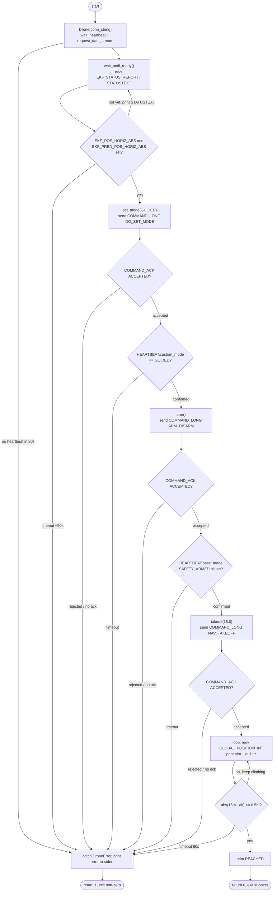

# part1_takeoff.py flow

```mermaid
flowchart TD
    Start([start]) --> Connect["Drone(conn_string)\nwait_heartbeat + request_data_stream"]
    Connect -->|no heartbeat in 30s| Err
    Connect --> Ready["wait_until_ready()\nrecv EKF_STATUS_REPORT / STATUSTEXT"]

    Ready --> ReadyCheck{"EKF_POS_HORIZ_ABS and\nEKF_PRED_POS_HORIZ_ABS\nset?"}
    ReadyCheck -->|not yet, print STATUSTEXT| Ready
    ReadyCheck -->|timeout ~90s| Err
    ReadyCheck -->|yes| SetMode["set_mode(GUIDED)\nsend COMMAND_LONG DO_SET_MODE"]

    SetMode --> ModeAck{COMMAND_ACK ACCEPTED?}
    ModeAck -->|rejected / no ack| Err
    ModeAck -->|accepted| ModeConfirm{"HEARTBEAT.custom_mode\n== GUIDED?"}
    ModeConfirm -->|timeout| Err
    ModeConfirm -->|confirmed| Arm["arm()\nsend COMMAND_LONG ARM_DISARM"]

    Arm --> ArmAck{COMMAND_ACK ACCEPTED?}
    ArmAck -->|rejected / no ack| Err
    ArmAck -->|accepted| ArmConfirm{"HEARTBEAT.base_mode\nSAFETY_ARMED bit set?"}
    ArmConfirm -->|timeout| Err
    ArmConfirm -->|confirmed| Takeoff["takeoff(15.0)\nsend COMMAND_LONG NAV_TAKEOFF"]

    Takeoff --> TakeoffAck{COMMAND_ACK ACCEPTED?}
    TakeoffAck -->|rejected / no ack| Err
    TakeoffAck -->|accepted| Climb["loop: recv GLOBAL_POSITION_INT\nprint alt=... at 1Hz"]

    Climb --> AltCheck{"abs(15m - alt) <= 0.5m?"}
    AltCheck -->|no, keep climbing| Climb
    AltCheck -->|timeout 60s| Err
    AltCheck -->|yes| Reached["print REACHED"]

    Reached --> Success(["return 0, exit success"])
    Err["catch DroneError, print error to stderr"] --> Fail(["return 1, exit non-zero"])
```
