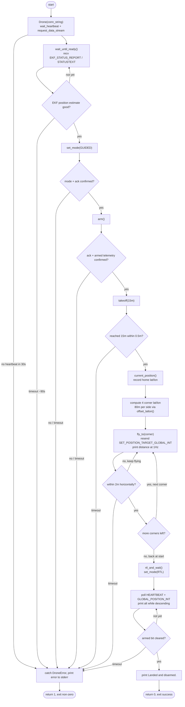

# part2_square.py flow

```mermaid
flowchart TD
    Start([start]) --> Connect["Drone(conn_string)\nwait_heartbeat + request_data_stream"]
    Connect -->|no heartbeat in 30s| Err
    Connect --> Ready["wait_until_ready()\nrecv EKF_STATUS_REPORT / STATUSTEXT"]

    Ready --> ReadyCheck{EKF position estimate good?}
    ReadyCheck -->|not yet| Ready
    ReadyCheck -->|timeout ~90s| Err
    ReadyCheck -->|yes| SetMode["set_mode(GUIDED)"]

    SetMode --> ModeConfirm{mode + ack confirmed?}
    ModeConfirm -->|no / timeout| Err
    ModeConfirm -->|yes| Arm["arm()"]

    Arm --> ArmConfirm{ack + armed telemetry confirmed?}
    ArmConfirm -->|no / timeout| Err
    ArmConfirm -->|yes| Takeoff["takeoff(15m)"]

    Takeoff --> TakeoffCheck{reached 15m within 0.5m?}
    TakeoffCheck -->|timeout| Err
    TakeoffCheck -->|yes| Home["current_position()\nrecord home lat/lon"]

    Home --> Corners["compute 4 corner lat/lon\n80m per side via offset_latlon()"]
    Corners --> Fly["fly_to(corner)\nresend SET_POSITION_TARGET_GLOBAL_INT\nprint distance at 1Hz"]

    Fly --> CornerCheck{within 2m horizontally?}
    CornerCheck -->|no, keep flying| Fly
    CornerCheck -->|timeout| Err
    CornerCheck -->|yes| MoreCorners{more corners left?}

    MoreCorners -->|yes, next corner| Fly
    MoreCorners -->|no, back at start| Rtl["rtl_and_wait()\nset_mode(RTL)"]

    Rtl --> LandCheck["poll HEARTBEAT + GLOBAL_POSITION_INT\nprint alt while descending"]
    LandCheck --> DisarmCheck{armed bit cleared?}
    DisarmCheck -->|not yet| LandCheck
    DisarmCheck -->|timeout| Err
    DisarmCheck -->|yes| Done["print Landed and disarmed."]

    Done --> Success(["return 0, exit success"])
    Err["catch DroneError, print error to stderr"] --> Fail(["return 1, exit non-zero"])
```
