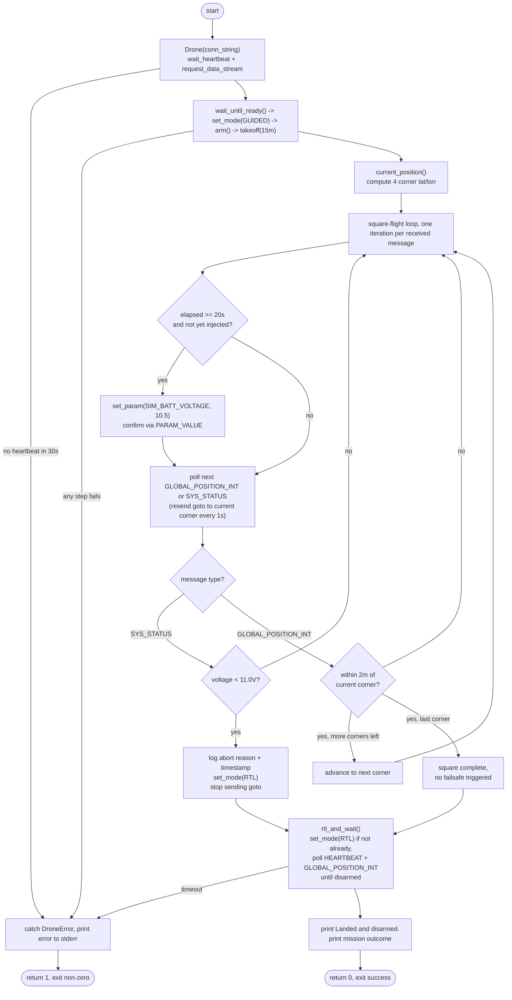

# part3_failsafe.py flow

Single-loop state machine: mission flying and battery monitoring share one
MAVLink connection and interleave on every received message, rather than
running on separate threads.

